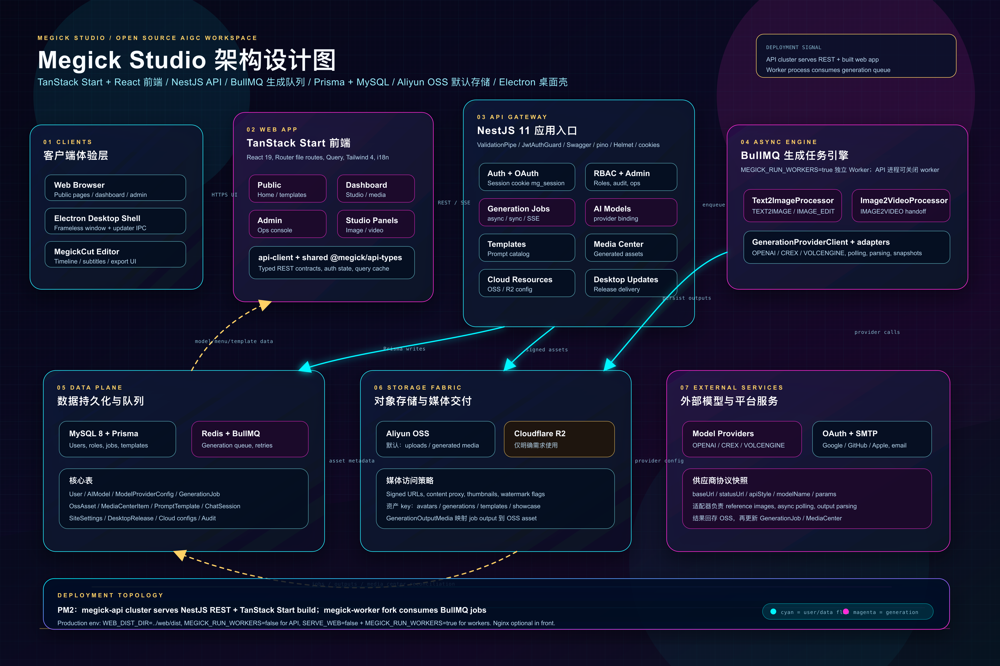

# Megick Studio

<p align="center">
  
</p>

<p align="center">
  <strong>Open-source AI image and video creation platform with 100+ model support</strong>
</p>

<p align="center">
  <strong>English</strong>
  ·
  <a href="./README.zh-CN.md">简体中文</a>
</p>

<p align="center">
  <a href="https://megick.com">Website</a>
  ·
  <a href="https://github.com/zeeklog/megick-studio">GitHub</a>
  ·
  <a href="#quick-start">Quick Start</a>
  ·
  <a href="#tech-stack">Tech Stack</a>
</p>

Megick Studio brings AI image generation, AI video generation, media asset management, template operations, model provider configuration, and admin tooling into one self-hostable creative workspace. It focuses on creation workflows, model access, asset management, and operations so teams can build private AIGC production environments or use it as a foundation for secondary development.

## Video Example


## UI Preview

| Home | Image Generation |
| --- | --- |
|  |  |

| Video Generation | Video Editor |
| --- | --- |
|  |  |

## Core Features


- AI image studio: text-to-image, reference-image generation, image editing, and common creative workflows.
- AI video studio: text-to-video and image-to-video, controlled by site settings.
- Template center: public templates, category management, review, publishing, and admin operations.
- Media center: unified management for generated outputs, user uploads, and OSS/R2 media references.
- MegickCut: browser-based video editor with timeline, subtitles, and export workflows.
- Admin console: users, roles, models, providers, templates, storage, queues, audit logs, and site settings.
- Credits system: administrator-managed credit adjustments, without a built-in online purchase flow.

## Architecture Diagram



## Tech Stack

| Layer | Technology |
| --- | --- |
| Web | TanStack Start, React 19, Tailwind CSS 4, shadcn/ui |
| API | NestJS 11, Prisma, MySQL 8, BullMQ, Redis |
| Storage | Aliyun OSS by default; Cloudflare R2 only when explicitly configured or required |
| Desktop | Electron desktop wrapper |
| Workspace | pnpm workspaces |

## Repository Structure

```text
megick-studio/
├── apps/
│   ├── api/          # NestJS API, Prisma schema, workers
│   ├── web/          # TanStack Start frontend and /admin
│   └── desktop/      # Desktop shell
├── packages/
│   └── api-types/    # Shared API types generated from OpenAPI
├── docs/             # Provider and prompt documents
├── examples/         # README screenshots and videos
├── .env.example
├── ecosystem.config.cjs
└── pnpm-workspace.yaml
```

## Requirements

- Node.js 22 recommended; Node.js 20+ usually works.
- pnpm 9.12.0.
- MySQL 8.
- Redis 6+.
- Aliyun OSS bucket. Cloudflare R2 is optional and should only be configured when explicitly needed.

## Quick Start

### 1. Install Dependencies

```bash
pnpm install
```

### 2. Prepare Environment Variables

```bash
cp .env.example .env
cp apps/api/.env.example apps/api/.env.development.local
cp apps/web/.env.example apps/web/.env.development.local
```

For local database operations, use the `DATABASE_URL` from `apps/api/.env.development.local`. Do not commit real database, OSS, model provider, or OAuth secrets.

Minimum required configuration:

| Variable | Description |
| --- | --- |
| `DATABASE_URL` | MySQL connection string |
| `REDIS_HOST` / `REDIS_PORT` | Redis connection settings |
| `APP_ENCRYPTION_KEY` | Encrypts third-party secrets; `openssl rand -base64 32` is recommended |
| `SESSION_SECRET` | Session signing secret; `openssl rand -base64 32` is recommended |
| `OSS_REGION` / `OSS_BUCKET` / `OSS_ACCESS_KEY_ID` / `OSS_ACCESS_KEY_SECRET` | Aliyun OSS configuration |
| `WEB_BASE_URL` / `API_BASE_URL` / `PUBLIC_BASE_URL` | Local or deployed public URLs |

### 3. Initialize the Database

```bash
pnpm prisma:generate
pnpm --filter @megick/api prisma:migrate:dev
pnpm prisma:seed
```

Default seed administrator:

```text
Email: administrator@megick.com
Password: PleaseChangeMe!2026
```

Change the default password immediately after first login.

### 4. Start Development Services

Start API and Web separately:

```bash
pnpm dev:api
pnpm dev:web
```

Default URLs:

| Service | URL |
| --- | --- |
| API | http://localhost:3001 |
| Web | http://localhost:8080 |
| Admin | http://localhost:8080/admin |
| Swagger | http://localhost:3001/api/docs |

## Common Commands

```bash
pnpm dev:api
pnpm dev:web
pnpm dev:desktop
pnpm typecheck
pnpm lint
pnpm build
pnpm prisma:generate
pnpm --filter @megick/api prisma:migrate:dev
pnpm prisma:migrate
pnpm prisma:seed
pnpm openapi:emit
pnpm openapi:types
```

When changing the Prisma schema or adding migrations, always generate the Prisma client, apply or check migrations against the active database, and verify the affected API endpoint or query. Do not rely on typecheck alone for database shape changes.

## Production Build

```bash
pnpm build
pnpm prisma:migrate
pm2 start ecosystem.config.cjs
```

You can also use the repository deployment script:

```bash
pnpm pm2:deploy
```

The NestJS API can serve the built Web application as the entry service. If you put Nginx in front, configure enough `client_max_body_size` for media uploads and desktop installer delivery.

## Model Providers and Generation Protocols

Megick Studio uses explicit provider API styles to describe model provider protocols. Current persisted styles include `OPENAI` and `CREX`; generation jobs snapshot provider base URL, status URL, model name, params, and protocol style.

Image generation adapter logic lives in `apps/api/src/modules/generation/text2image.adapters.ts`. When adding a new provider, explicitly handle reference image mapping, async polling, output parsing, and OSS persistence instead of inferring behavior only from the vendor name.

## Storage Policy

The project supports Aliyun OSS and Cloudflare R2 buckets. The global default storage bucket is Aliyun OSS. Unless a product requirement or user request explicitly specifies Cloudflare R2, uploads, generated media persistence, user assets, product materials, and admin media should use the existing OSS flow.

## Contributing

Issues and pull requests are welcome: <https://github.com/zeeklog/megick-studio>

Before submitting a PR, run the relevant typecheck. If your change affects the database or API shape, include the necessary Prisma/OpenAPI updates and describe the endpoint or query you verified.
