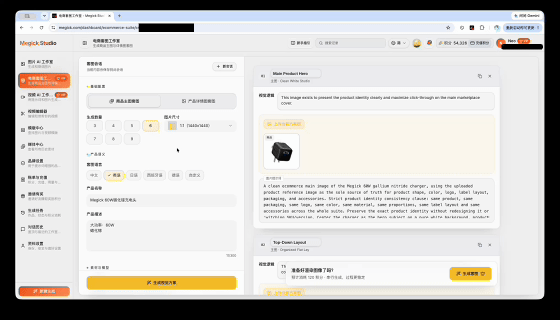
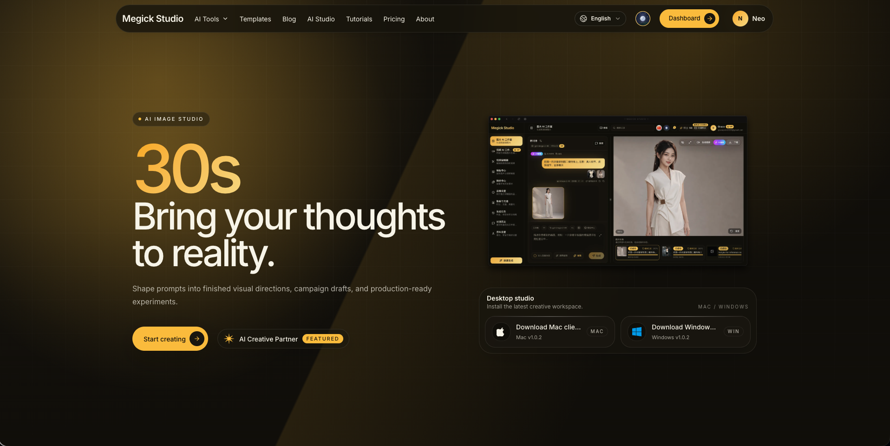
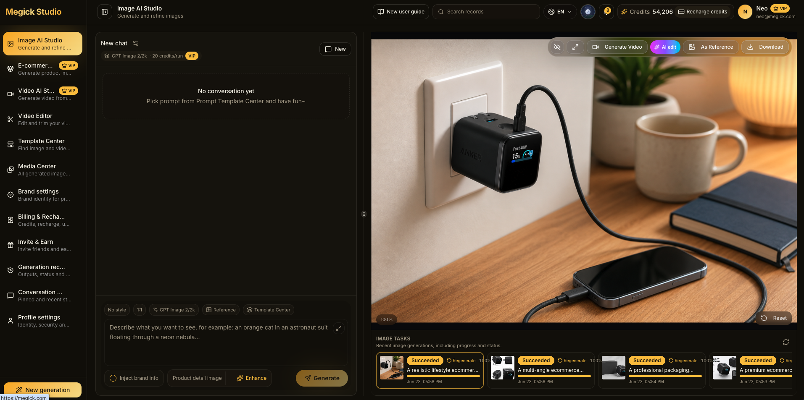
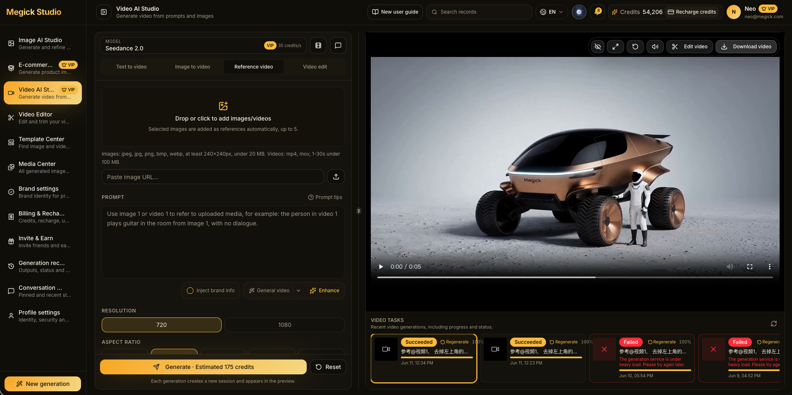
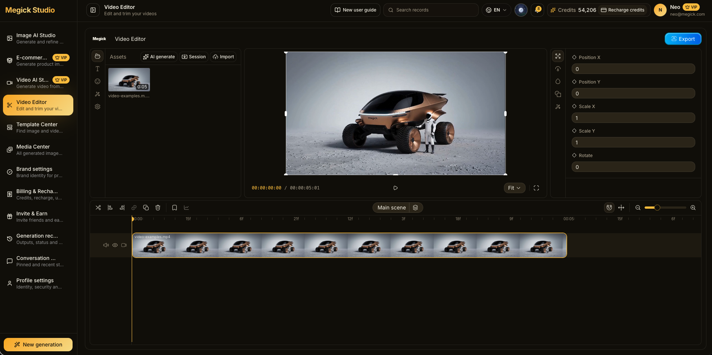

# Megick Studio

<p align="center">
  
</p>


<p align="center">
  <strong>支持100+模型的开源 AI 图像与视频创作平台</strong>
</p>

<p align="center">
  <a href="https://megick.com">Website</a>
  ·
  <a href="https://github.com/zeeklog/megick-studio">GitHub</a>
  ·
  <a href="#快速开始">Quick Start</a>
  ·
  <a href="#技术栈">Tech Stack</a>
</p>

Megick Studio 将 AI 图像生成、AI 视频生成、媒体资产管理、模板运营、模型供应商配置和后台管理整合在一个可自托管的工作台中。开源版聚焦创作链路、模型接入、素材管理和运维后台，适合团队搭建私有化 AIGC 生产环境或作为二次开发基础。




## 视频案例

视频案例优先展示创作结果和核心体验。GitHub 无法在所有场景内联播放本地视频时，可点击链接直接打开。

| 视频生成案例 | 扩展生成案例 |
| --- | --- |
| [Megick Video Generate Examples](./examples/video-examples.mp4) | [Megick E-commerce Suite Generate](./examples/ecommerce-suite-generate.mov) |

## 界面预览

| 首页 | 图像生成 |
| --- | --- |
|  |  |

| 视频生成 | 视频编辑 |
| --- | --- |
|  |  |

## 核心能力

- AI 图像工作台：支持文生图、参考图生成、图像编辑等常见创作流程。
- AI 视频工作台：支持文生视频、图生视频，并通过站点配置控制开放能力。
- 模板中心：支持公开模板、分类管理、审核发布和后台运营。
- 媒体中心：统一管理生成结果、用户上传素材和 OSS/R2 媒体引用。
- MegickCut：浏览器端视频编辑器，提供时间线、字幕和导出能力。
- 管理后台：覆盖用户、角色、模型、供应商、模板、存储、队列、审计日志和站点设置。
- 积分体系：开源版支持后台人工调整用户积分，不包含在线支付购买流程。

## 技术栈

| 层级 | 技术 |
| --- | --- |
| Web | TanStack Start, React 19, Tailwind CSS 4, shadcn/ui |
| API | NestJS 11, Prisma, MySQL 8, BullMQ, Redis |
| Storage | Aliyun OSS 默认存储；Cloudflare R2 仅在明确配置或需求指定时使用 |
| Desktop | Electron desktop wrapper |
| Workspace | pnpm workspaces |

## 仓库结构

```text
megick-studio/
├── apps/
│   ├── api/          # NestJS API, Prisma schema, workers
│   ├── web/          # TanStack Start frontend and /admin
│   └── desktop/      # Desktop shell
├── packages/
│   └── api-types/    # Shared API types generated from OpenAPI
├── docs/             # Provider and prompt documents
├── examples/         # README screenshots and videos
├── .env.example
├── ecosystem.config.cjs
└── pnpm-workspace.yaml
```

## 环境要求

- Node.js 22 推荐；Node.js 20+ 通常可用。
- pnpm 9.12.0。
- MySQL 8。
- Redis 6+。
- Aliyun OSS bucket。Cloudflare R2 是可选能力，仅在明确需要时配置。

## 快速开始

### 1. 安装依赖

```bash
pnpm install
```

### 2. 准备环境变量

```bash
cp .env.example .env
cp apps/api/.env.example apps/api/.env.development.local
cp apps/web/.env.example apps/web/.env.development.local
```

本地开发数据库操作请使用 `apps/api/.env.development.local` 中的 `DATABASE_URL`。不要提交真实数据库、OSS、模型供应商或 OAuth 密钥。

最少需要配置：

| 变量 | 说明 |
| --- | --- |
| `DATABASE_URL` | MySQL 连接字符串 |
| `REDIS_HOST` / `REDIS_PORT` | Redis 连接信息 |
| `APP_ENCRYPTION_KEY` | 用于加密第三方密钥，建议 `openssl rand -base64 32` 生成 |
| `SESSION_SECRET` | 会话签名密钥，建议 `openssl rand -base64 32` 生成 |
| `OSS_REGION` / `OSS_BUCKET` / `OSS_ACCESS_KEY_ID` / `OSS_ACCESS_KEY_SECRET` | Aliyun OSS 配置 |
| `WEB_BASE_URL` / `API_BASE_URL` / `PUBLIC_BASE_URL` | 本地或部署后的公开访问地址 |

### 3. 初始化数据库

```bash
pnpm prisma:generate
pnpm --filter @megick/api prisma:migrate:dev
pnpm prisma:seed
```

默认种子管理员：

```text
Email: administrator@megick.com
Password: PleaseChangeMe!2026
```

首次登录后请立即修改默认密码。

### 4. 启动开发服务

分别启动 API 和 Web：

```bash
pnpm dev:api
pnpm dev:web
```

默认地址：

| 服务 | 地址 |
| --- | --- |
| API | http://localhost:3001 |
| Web | http://localhost:8080 |
| Admin | http://localhost:8080/admin |
| Swagger | http://localhost:3001/api/docs |

## 常用命令

```bash
pnpm dev:api
pnpm dev:web
pnpm dev:desktop
pnpm typecheck
pnpm lint
pnpm build
pnpm prisma:generate
pnpm --filter @megick/api prisma:migrate:dev
pnpm prisma:migrate
pnpm prisma:seed
pnpm openapi:emit
pnpm openapi:types
```

当修改 Prisma schema 或新增迁移时，必须生成 Prisma client、对当前数据库执行或检查迁移，并验证受影响的 API endpoint 或查询；不要只依赖 typecheck。

## 生产构建

```bash
pnpm build
pnpm prisma:migrate
pm2 start ecosystem.config.cjs
```

也可以使用仓库脚本执行 PM2 部署：

```bash
pnpm pm2:deploy
```

NestJS API 可作为入口服务托管构建后的 Web 应用。若通过 Nginx 代理，请根据媒体上传和桌面安装包分发需求配置足够的 `client_max_body_size`。


## 模型供应商与生成协议

Megick Studio 使用显式的 provider API style 描述模型供应商协议。当前持久化配置包含 `OPENAI` 和 `CREX`，生成任务会快照供应商的 base URL、status URL、模型名、参数和协议风格。

图像生成适配逻辑位于 `apps/api/src/modules/generation/text2image.adapters.ts`。接入新供应商时，请明确处理参考图映射、异步任务轮询、输出解析和 OSS 持久化，不要仅按厂商名称隐式推断协议。

## 存储策略

项目支持 Aliyun OSS 和 Cloudflare R2 两类 bucket。全局默认存储为 Aliyun OSS；除非产品需求或用户明确指定使用 Cloudflare R2，否则上传、生成媒体持久化、用户素材、产品物料和后台媒体都应走项目现有 OSS 流程。

## 贡献

欢迎通过 Issue 和 Pull Request 参与改进：<https://github.com/zeeklog/megick-studio>

提交 PR 前，请运行相关 typecheck。若变更影响数据库或 API shape，请同时提交 Prisma/OpenAPI 的必要更新，并说明验证过的接口或查询。
